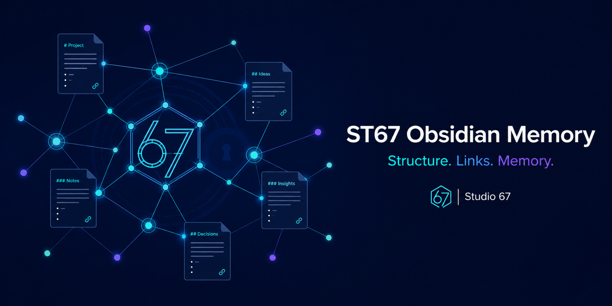

**English** | [Русский](README.ru.md)

# ST67 Obsidian Memory — v0.2.0

Give your AI agent a memory that survives the chat. This Codex Agent Skill maintains confirmed facts, decisions, tasks, problems and useful links in ordinary Markdown. Obsidian is optional.



## Operating modes

The short SKILL.md routes to separate creation, migration, maintenance, naming, audit and explicit thread-completion procedures. Only needed references are loaded; unchanged context is reused. At first substantive use or a topic change, search existing TODOs, plans, active/completed problems, decisions and completed work by object/aliases. A query does not modify the base or authorize matched tasks.

An implementation instruction authorizes necessary updates within its scope without repeated confirmation. Design-only requests stay proposals. Structural expansion and irreversible deletion of valuable materials need agreement. Existing ownership, paths, names and lifecycle are preserved until an approved migration. History is not evidence of current infrastructure state; automated checks do not replace semantic or live-state verification.

## New-base standard: naming-v1

Minimum: `IDX_ATLAS.md`, `CFG_ATLAS.json`, and `LOG_ATLAS-0001_2026-10.md` from the first journaled event. No empty monthly logs. TODO appears at the first open question; cards and folders appear as needed. Shared maintenance/Link Workflow remain in the skill, with local parameters and special procedures at the base.

The fixed type vocabulary is `IDX CFG LOG TODO HOST DEV APP SRV NET STO PLN CPLD TRB CTRB DEC RSR RPT RUL ATT RAW TMP`. Services use SRV. Each base has a permanent unique namespace, distinct from its logical owner and optional parent. Reparenting never changes filenames.

Numbered files use `TYPE_BASE-NNNN_topic`, with dates for plans/problems/decisions/reports/logs. Each type has its own non-reused sequence. A designated allocator reserves IDs and retains high-water marks in CFG, even after failure/deletion; other masters edit existing records or prepare content. This release has no central allocator service or distributed lock. Closing PLN/TRB allocates CPLD/CTRB with a new ID and retained source_id. Completed work is not automatically a decision. Full examples: [naming and numbering](skills/obsidian-memory/references/naming-and-numbering.md), [templates](skills/obsidian-memory/references/file-templates.md).

## Install

Ask `$skill-installer` to install from:

```text
https://github.com/RomanovVIII/st67-obsidian-memory/tree/v0.2.0/skills/obsidian-memory
```

Alternatively download `obsidian-memory-v0.2.0.zip` from the release, verify SHA256SUMS, and copy its `obsidian-memory` folder into your environment's user skill directory. Runtime version is in VERSION. Restart Codex if necessary. Existing bases and other agents' installations are not migrated automatically.

## Link auditor

```bash
python3 skills/obsidian-memory/scripts/link_audit.py /path/to/base --strict-exit
python3 skills/obsidian-memory/scripts/link_audit.py /path/to/base --changed cards/service.md --strict-exit
python3 skills/obsidian-memory/scripts/link_audit.py /path/to/base --changed cards/new.md --removed cards/old.md --json --strict-exit
```

Repeated `--changed` accepts existing changed documents/attachments, `--removed` absent former paths. Local mode checks affected incoming/outgoing links, registration and applicable lifecycle/naming constraints. Unrelated errors do not affect its result; the report states its scope. Inventory and other documents' links may be scanned for resolution.

Schema v1/v2 remain supported; schema v3 adds file_namespace, naming_profile, allocation_owner, last_issued and optional parent_base_id. Explicit `--config` wins; otherwise legacy `obsidian-memory.config.json`, then a unique root `CFG_*.json`; multiple candidates return 2. Without configuration, index.md remains the fallback. `--index` overrides the selected index.

Public flags `--vault-root`, repeated `--index-exclude`, `--strict-exit` and earlier counters remain. A larger vault boundary must be confirmed as the same base; independent bases never resolve wiki links between them. Index-only exclusions do not disable link checks. `--compare-root` only compares managed filenames, locally limited to touched names. Unicode NFC and case-insensitive collisions include documents and attachments. Legal parent paths inside the boundary are accepted; escaping links and unsafe input/symlinks are rejected. Heading/block targets are checked outside code examples, using original source line numbers.

**No file writes or network calls by default.** `--json` prints a safe report. Only explicit `--json-out` writes a report inside the inspected root; only explicit `--check-urls` checks configured URL classes (changed documents in local mode). No external processes or third-party runtime dependencies. Text, JSON and stderr diagnostics omit raw link values and URL credentials.

Exit codes: 0 successful execution, 1 strict findings with --strict-exit, 2 invalid arguments/configuration/boundaries. Read-only audit can detect problems without repairing them.

## Structure auditor

```bash
python3 skills/obsidian-memory/scripts/structure_audit.py /path/to/project
python3 skills/obsidian-memory/scripts/structure_audit.py /path/to/base --profile naming-v1 --strict-exit
python3 skills/obsidian-memory/scripts/structure_audit.py /path/to/project --wiki-root wiki_example --code EXAMPLE --strict-exit
```

The old call preserves the legacy onboarding profile and counters. The explicit naming-v1 profile checks the new minimum, identities, counters and uniqueness; gaps and months without events are valid. Do not apply legacy layout requirements to new bases. Sensitive-data inventory reports categories, not values. Both auditors are read-only except the link auditor's explicitly requested JSON report.

## Explicit completion and cleanup

An explicit command to finish a thread reconciles confirmed results, related tasks and links, retaining unfinished work. It checks only confirmed task-related raw/inbox and tmp/temp roots. Raw is normally retained; deletion requires verified transferred knowledge, an exact permanent original copy with matching checksum, no active references and no continuation/recovery need. Delete only the agent's exhausted current-work temporary materials. Preserve useful, foreign, old or unclear objects and list them for the user's decision. No OS temporary-directory sweep, indiscriminate deletion, automatic task closure or chat archiving.

## Requirements and development

Python 3.9+, standard library only; Windows, macOS and Linux. Codex is the primary environment; other compatible agent environments need separate verification.

```bash
python3 -B -m unittest discover -s tests -v
python3 -m compileall -q skills tests
```

CI runs Ubuntu/macOS/Windows on Python 3.9 and 3.14. Tests live outside the installable runtime. Run the official skill validator available in your development environment. See [CONTRIBUTING.md](CONTRIBUTING.md), [CHANGELOG.md](CHANGELOG.md) and [SECURITY.md](SECURITY.md).

Developer: Studio 67. Author and copyright holder: Master V. Technical co-developer: MacMaster; v0.2.0 integration: Master X. [MIT License](LICENSE).

Obsidian is a trademark of Dynalist Inc. This independent Studio 67 project is not affiliated with or endorsed by Dynalist Inc. or OpenAI.
